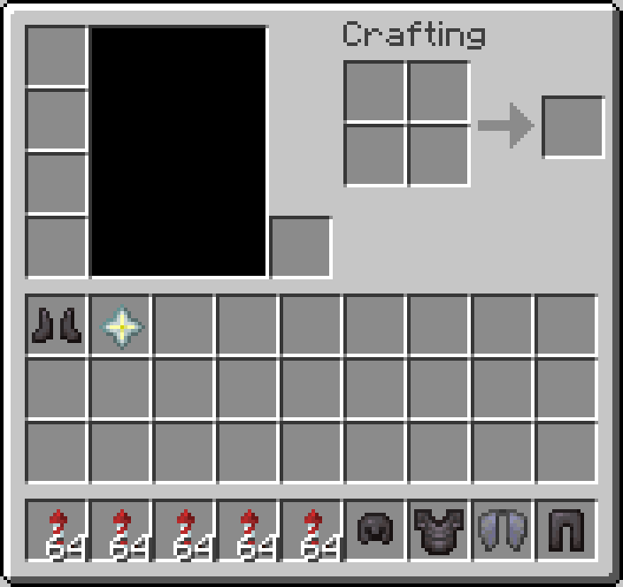

# Tester Thank-You Kit

**English** | [繁體中文](README.zh-TW.md)

Thanks your beta testers with a commemorative, fully enchanted netherite set, an elytra and a thank-you medal - and lets admins recall or audit the kits later.

> This repository has two editions of the same script: **繁體中文 (zh-TW)** is the original used on the author's Traditional Chinese server, and **English** is a full translation (commands, messages and variable names) with the same features.

<!-- BEGIN LIVE SCREENSHOTS -->

## Screenshots

*A throwaway test account right after `/發放感謝套裝`: the full netherite set, an elytra, the commemorative nether star medal and firework rockets.*

> These are live-server captures, not native client screenshots. A headless client logged into a real Paper 26.2 server, triggered the script, and the block / UI data the server sent back was re-rendered using the official Minecraft 26.2 client assets. Mojang/Microsoft image assets are not covered by this repository's code licence.

<!-- END LIVE SCREENSHOTS -->

## Features

- Netherite helmet, chestplate, leggings and boots plus an elytra, with all protection enchantments, Thorns, Unbreaking, Mending and the matching extras (Respiration, Aqua Affinity, Swift Sneak, Feather Falling, Depth Strider, Soul Speed, Frost Walker)
- A thank-you medal (nether star) with lore
- Give to one player or to everyone online
- Recall from one player or everyone (armor slots and inventory) and list who still has it

## Requirements

- [Paper](https://papermc.io/) server (developed on Paper 26.2 / Minecraft 26.2)
- [Skript](https://github.com/SkriptLang/Skript) (developed on 2.16.2)

## Installation

1. Install the plugins listed under [Requirements](#requirements).
2. Download **one** edition:

   | Edition | File(s) |
   |---|---|
   | English | [`en/tester-thank-you-kit.sk`](en/tester-thank-you-kit.sk) |
   | 繁體中文 (original) | [`zh-TW/測試人員感謝套裝發放.sk`](zh-TW/%E6%B8%AC%E8%A9%A6%E4%BA%BA%E5%93%A1%E6%84%9F%E8%AC%9D%E5%A5%97%E8%A3%9D%E7%99%BC%E6%94%BE.sk) |

3. Copy the `.sk` file(s) into `plugins/Skript/scripts/` on your server.
4. Run `/sk reload tester-thank-you-kit` (use the file name you copied) or restart the server.

> [!IMPORTANT]
> Install **only one** edition. Both editions are the same script in different languages - loading both makes them clash or run twice.

## Commands

| Command (English edition) | zh-TW edition | Description | Permission |
|---|---|---|---|
| `/givethankskit [player]` | `/發放感謝套裝 [玩家]` | Give the kit to a player, or to everyone online when omitted | OP |
| `/recallthankskit <player>` | `/回收感謝套裝 <玩家>` | Recall the kit from a player | OP |
| `/recallallthankskits` | `/回收全部感謝套裝` | Recall the kit from everyone online | OP |
| `/checkthankskits` | `/查看感謝套裝` | List the online players who have the kit | OP |

## Configuration

- Change `armor_name` / `medal_name` in `options:` and the date in the lore lines (`2026/4/27`) for your own event. Items are recognized by their exact name, so keep the names unique.

## Notes

- Recall and check only cover players who are online.

## Related projects

- [skript-test-gear-distribution](https://github.com/Im-Tim-mI/skript-test-gear-distribution) - Test Gear Distribution
- [skript-special-item-lock](https://github.com/Im-Tim-mI/skript-special-item-lock) - Special Item Lock

## License

**MIT + Commons Clause** - see [LICENSE](LICENSE) for the full text.

- ✅ You may use, copy, modify and share this script.
- ✅ You **may** install and run it - including modified versions - on Minecraft servers that charge money or are run for profit.
- ❌ You may **not** sell the script itself or modified versions of it, directly or indirectly, or require payment to obtain its files or source code.

Copyright (c) 2026 廷廷小教室、廷廷的家（Tim945）
